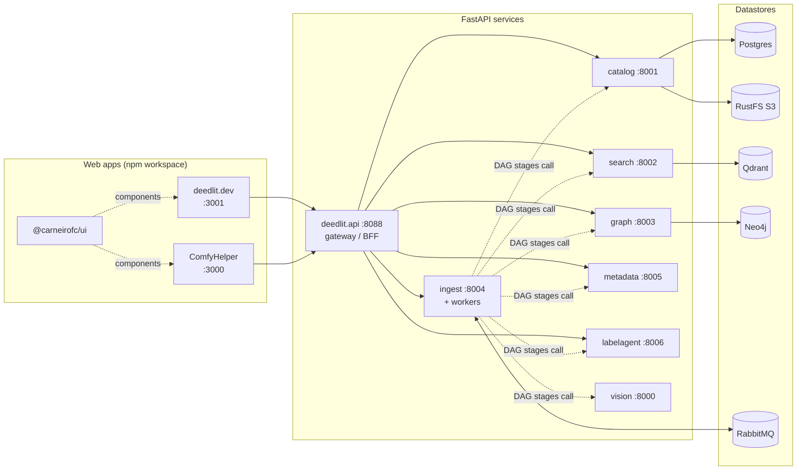
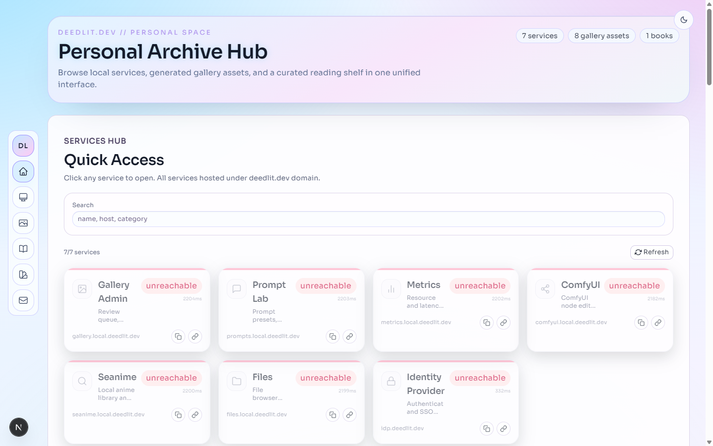
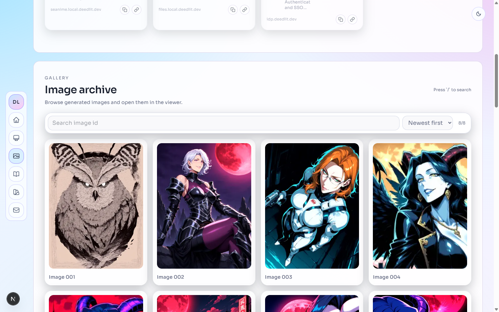
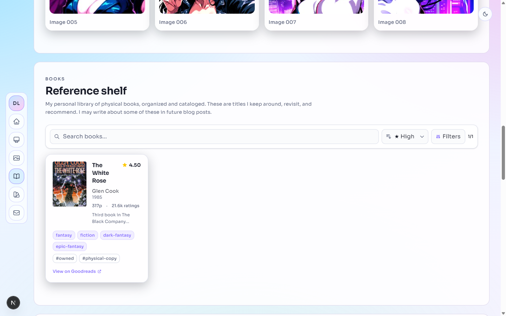
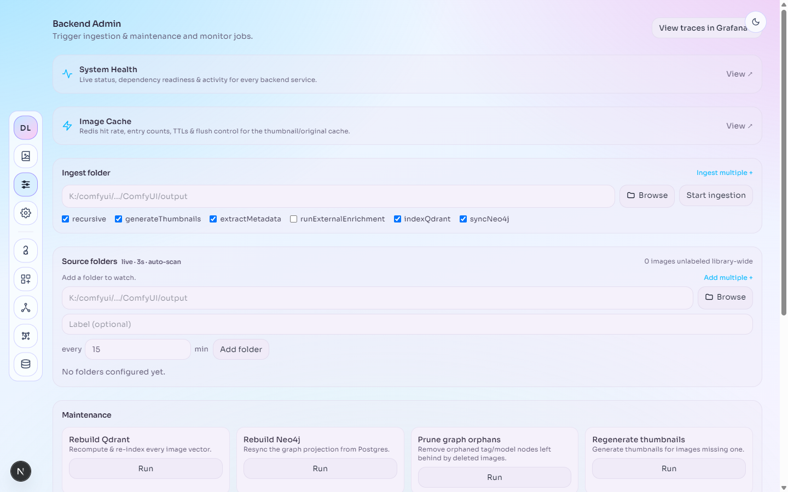
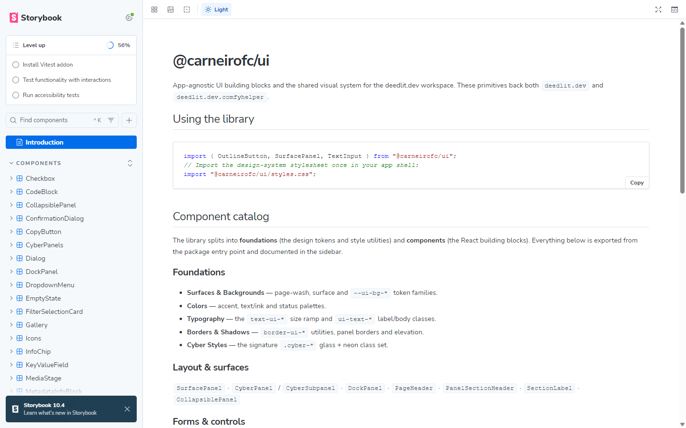
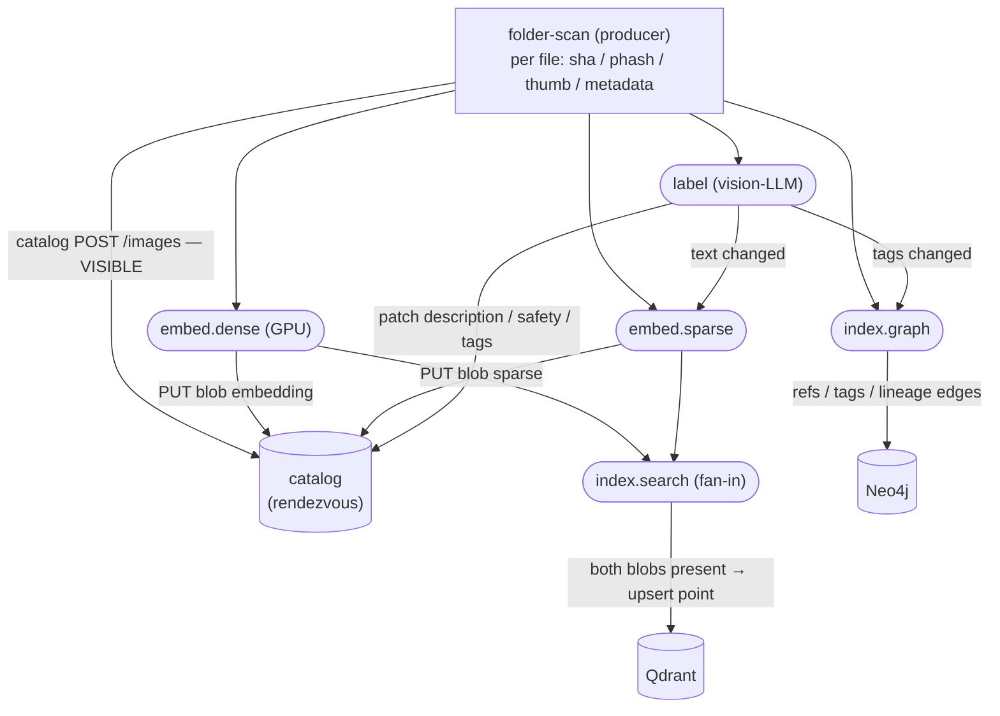

# deedlit.dev — Monorepo

The deedlit.dev landing site plus **ComfyHelper**, a generated-image library that
ingests, searches, and explores ComfyUI / Automatic1111 outputs. The web apps are
an npm workspace; the image-library backend is a mesh of standalone **FastAPI**
services (database-per-service, HTTP-only) managed with `uv`.

## Architecture

The frontends talk only to the `deedlit.api` gateway (BFF). Each owning service is
the sole writer of its datastore and they never call each other — `search` and
`graph` are rebuildable projections of `catalog` (the canonical truth). See
[`deedlit.dev.comfyhelper/IMAGE_LIBRARY.md`](./deedlit.dev.comfyhelper/IMAGE_LIBRARY.md)
for the full design.



### Web apps (npm workspace)

| Package | Port | Description |
|---|---|---|
| [`deedlit.dev`](./deedlit.dev/) | 3001 | Public Next.js site — home, books, gallery, services |
| [`deedlit.dev.comfyhelper`](./deedlit.dev.comfyhelper/) | 3000 | ComfyHelper UI for the image library |
| [`deedlit.dev.ui`](./deedlit.dev.ui/) | — | Shared `@carneirofc/ui` component library — [live Storybook](https://carneirofc.github.io/deedlit.dev/ui/storybook/) |

#### deedlit.dev — public site

Home hub with quick access to self-hosted services, an image gallery, and the
reference book shelf:

| Home / services hub | Image archive | Reference shelf |
|---|---|---|
|  |  |  |

#### ComfyHelper — image library

Library browser with hybrid search, tag/safety filters and a Neo4j graph filter;
admin page for ingestion, source folders, cache and maintenance jobs:

| Image library | Backend admin |
|---|---|
|  |  |

#### @carneirofc/ui — Storybook

Every shared component is documented in Storybook — browse it live at
[carneirofc.github.io/deedlit.dev/ui/storybook](https://carneirofc.github.io/deedlit.dev/ui/storybook/)
(see [GitHub Pages](#github-pages)):



### Services (FastAPI, `uv` per-package venv)

| Service | Port | Owns | Responsibility |
|---|---|---|---|
| [`deedlit.api`](./deedlit.api/) | 8088 | — | Gateway/BFF: aggregate detail pages, host MCP, dispatch ingest jobs |
| [`deedlit.catalog`](./deedlit.catalog/) | 8001 | Postgres + RustFS | Canonical: images, tags, params, references, ratings, notes, collections, thumbnails, cached vectors |
| [`deedlit.search`](./deedlit.search/) | 8002 | Qdrant | Dense (CLIP) + sparse (SPLADE) hybrid vector search |
| [`deedlit.graph`](./deedlit.graph/) | 8003 | Neo4j | Shared-asset, tag co-occurrence, lineage edges |
| [`deedlit.ingest`](./deedlit.ingest/) | 8004 | — | Scan, hash, thumbnail; publishes the per-stage ingest DAG |
| [`deedlit.metadata`](./deedlit.metadata/) | 8005 | — | Bytes → embedded prompt/tags/params + resolved reference graph |
| [`deedlit.labelagent`](./deedlit.labelagent/) | 8006 | — | Vision-LLM describe/safety/tags (local llama-server) |
| [`deedlit.vision`](./deedlit.vision/) | 8000 | — | CLIP dense + SPLADE sparse embeddings (GPU) |

Ingest is fully queue-driven over RabbitMQ as a per-stage DAG (catalog write is the
durability boundary; projections converge via idempotent rebuilds). See
[ADR 0001](./docs/adr/0001-async-queues-for-labelling-and-indexing.md) and
[ADR 0002](./docs/adr/0002-per-stage-ingest-dag.md). The cross-service id is the
SHA-256 of the image bytes — see [`id-scheme/`](./id-scheme/README.md).



Each queue stage persists its output to catalog truth, then publishes its
successors (choreography, no orchestrator). `index.search` is the only fan-in:
whichever of `embed.dense`/`embed.sparse` finishes second finds both blobs in
the catalog and writes the Qdrant point — catalog presence is the latch.

### Infrastructure & observability (Docker Compose)

| Component | Port | Role |
|---|---|---|
| PostgreSQL | 5432 | Catalog (canonical truth) |
| Neo4j | 7474 / 7687 | Relationship graph |
| Qdrant | 6333 / 6334 | Vector store |
| RustFS (S3) | 9000 / 9001 | Thumbnails + cached embeddings |
| RabbitMQ | 5672 / 15672 | Ingest DAG broker + management UI |
| Redis | 6379 | Cache |
| Grafana / Loki / Tempo / Alloy | 3002 / 3100 / 3200 / 12345 | Logs, traces, OTLP collection, dashboards |

## Prerequisites

- **Node** managed by [fnm](https://github.com/Schniz/fnm); npm 10+
- **Python** managed by [uv](https://docs.astral.sh/uv/) (per-service venvs)
- **Docker** (Compose) for datastores and observability

On Windows/PowerShell, activate Node per session: `fnm env --use-on-cd | Out-String | Invoke-Expression`.
See [`AGENTS.md`](./AGENTS.md) for the full toolchain layout.

## Getting started

```bash
npm install                # install all JS workspaces
npm run infra:up           # start datastores + observability (waits for health)
npm run dev:migrate        # apply catalog Alembic migrations
npm run dev                # start every app + service via mprocs (one pane each)
```

`npm run dev` runs [`mprocs`](./mprocs.yaml): one pane per process, `r` restarts
one, `q` tears the whole tree down cleanly. `predev` runs `infra:up` + `dev:migrate`
for you. Run a single piece with `npm run dev:<name>` (e.g. `dev:dev`,
`dev:comfyhelper`, `dev:api`, `dev:catalog`, …) or all services without the web
apps via `npm run dev:services`.

## Building

```bash
npm run build:ui           # shared UI only
npm run build:dev          # landing site (+ UI)
npm run build:comfyhelper  # ComfyHelper (+ UI)
npm run build              # everything
```

Python services build via their per-package `Dockerfile`; `docker compose up`
brings up the full stack (see [`docker-compose.yml`](./docker-compose.yml), the
single compose file for the repo).

## GitHub Pages

The repo publishes a single GitHub Pages site via
[`storybook-pages.yml`](./.github/workflows/storybook-pages.yml):

- **<https://carneirofc.github.io/deedlit.dev/>** — the monorepo landing page
  (source: [`docs/site/index.html`](./docs/site/index.html)), showcasing the apps,
  services, architecture and screenshots.
- **<https://carneirofc.github.io/deedlit.dev/ui/storybook/>** — the
  `@carneirofc/ui` Storybook.

The workflow runs on every push to `master` that touches `deedlit.dev.ui/`,
`docs/site/` or `docs/screenshots/` (or manually via *workflow dispatch*), builds
the static Storybook and assembles both into one Pages artifact — the landing
page at the root and Storybook under `/ui/storybook`.

One-time repo setup: **Settings → Pages → Source: GitHub Actions**.

Run it locally instead with:

```bash
npm run storybook -w @carneirofc/ui          # dev server on :6006
npm run build-storybook -w @carneirofc/ui    # static build → deedlit.dev.ui/storybook-static
```

## Project structure

```
deedlit.dev/              ← landing site (Next.js)
deedlit.dev.comfyhelper/  ← ComfyHelper image-library UI (Next.js)
deedlit.dev.ui/           ← shared component library (@carneirofc/ui)
deedlit.<service>/        ← FastAPI services (api, catalog, search, graph,
                            ingest, metadata, labelagent, vision)
contracts/                ← OpenAPI design sketches per service surface
id-scheme/                ← frozen cross-service id helper + test vectors
docs/adr/                 ← architecture decision records
docs/agents/              ← agent workflow docs (issue tracker, triage, domain)
docker-compose.yml        ← the one compose file (datastores + services + o11y)
mprocs.yaml               ← local dev orchestrator
```

## Contributing

This repo uses **[Conventional Commits](https://www.conventionalcommits.org/)**:
`<type>(optional scope): <description>`. Common types: `feat`, `fix`, `docs`,
`chore`, `refactor`, `test`, `style`, `perf`.
